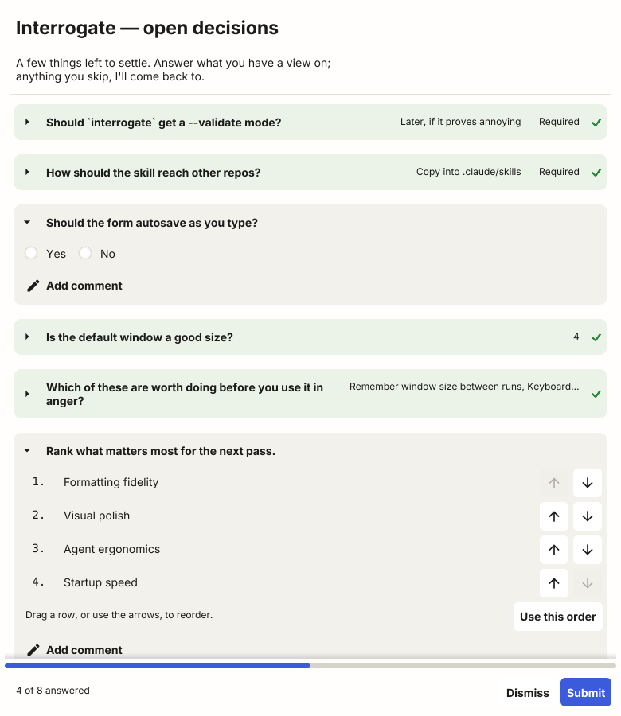

# interrogate

Ask someone a batch of questions in a desktop form, and get the answers back in
the same YAML file you asked them in.

It exists for agents. When a coding agent has four decisions blocking it, asking
them one at a time in chat is slow, easy to lose, and impossible to answer out
of order. `interrogate` turns them into a form: one scrolling page, answer in
any order, attach a comment to anything, submit once.



## Install

```bash
go install github.com/markwylde/interrogate@latest
```

Needs a desktop session. It is a native window — Fyne, not a browser — and a
single static binary with its font compiled in, so it looks the same on macOS,
Linux and Windows.

## Use

```bash
interrogate openspec/changes/add-dark-mode/questionnaires/scope.yaml
```

The form opens. On submit, the answers are written back into that same file and
printed to stdout as JSON.

To check a questionnaire without opening anything:

```bash
interrogate --validate openspec/changes/add-dark-mode/questionnaires/scope.yaml
```

A plain run already validates before it presents anything, so `--validate` is
for checking a questionnaire you have just written — an agent verifying its own
output — rather than for catching problems a normal run would miss. It writes
nothing and needs no display.

## The questionnaire

```yaml
# Questions are yours. Comments and formatting survive being answered.
title: Storage decisions
intro: |
  A few things to settle before I write the proposal.

status: pending
submitted_at: null

questions:
  - id: storage                   # unique; used as the answer key
    type: select
    prompt: Where do answers live?
    help: I'd lean towards in-place; two files drift apart.
    required: true
    options: [in-place, sidecar, both]

  - id: storage_why
    type: textarea
    prompt: What makes sidecar the right call?
    show_if:
      storage: sidecar            # only shown when that answer is chosen

  - id: priorities
    type: rank
    prompt: Rank these by importance.
    options: [correctness, speed, looks]
```

Answered, that same file becomes:

```yaml
# Questions are yours. Comments and formatting survive being answered.
title: Storage decisions
intro: |
  A few things to settle before I write the proposal.

status: submitted
submitted_at: "2026-09-01T12:00:00Z"

questions:
  - id: storage                   # unique; used as the answer key
    type: select
    prompt: Where do answers live?
    help: I'd lean towards in-place; two files drift apart.
    required: true
    options: [in-place, sidecar, both]
    answer: in-place
    comment: agreed, drift is the real risk

  - id: storage_why
    type: textarea
    prompt: What makes sidecar the right call?
    show_if:
      storage: sidecar            # only shown when that answer is chosen

  - id: priorities
    type: rank
    prompt: Rank these by importance.
    options: [correctness, speed, looks]
    answer:
      - correctness
      - looks
      - speed
```

Note what did **not** change: the comment at the top, the blank lines, the
inline note beside `id`, the quoting, the indentation. `interrogate` owns four
keys — `answer` and `comment` on each question, `status` and `submitted_at` at
the top — and rewrites nothing else. It edits the bytes in place rather than
re-serialising the document, because no Go YAML library round-trips with that
kind of fidelity.

`storage_why` was never shown, so it has no answer. A hidden question records
nothing and is never reported.

### Question types

| Type          | Answer                                    | Notes                             |
|---------------|-------------------------------------------|-----------------------------------|
| `select`      | one of `options`                          | radio buttons, or a dropdown past seven options |
| `multiselect` | any number of `options`                   | checkboxes                        |
| `text`        | a single line                             |                                   |
| `textarea`    | several lines                             | written back as a block scalar    |
| `number`      | a number                                  | `min` / `max` enforced as you type |
| `boolean`     | `true` or `false`                         | two choices, so "no" and "unanswered" stay distinct |
| `scale`       | a whole number                            | `min` / `max`, default 1–5        |
| `rank`        | all of `options`, reordered               | drag, or use the arrows; rows slide to their new place |

Each question sits on its own card, so they stay distinct while you scroll.

Cards **fold as you finish with them**, so the page is always a list of what is
left. A questionnaire opens with anything already answered folded and everything
outstanding open. Pick an option, a yes or no, a point on a scale, or confirm a
ranking, and that question drops to a single line too — its prompt, the answer
you gave, and a green tick, on a card tinted faintly green. A question you fold
with nothing answered keeps the ordinary colour: putting something aside is not
the same as finishing it.

Typed and multi-part answers have no single settling gesture, so `text`,
`number`, `textarea` and `multiselect` fold on **Done** instead, or on Enter in a
single-line field; nothing folds mid-word. Click any header to fold or unfold it
yourself, answered or not, and what you choose by hand stays as you left it. A
submit refused for a missing answer opens what it flags, so nothing you have to
fix stays hidden.

Every question also takes a **comment**, whatever its type, answered or not.
The field rests collapsed behind a small affordance so a page of questions is
not mostly empty boxes; once a comment exists, the affordance shows the start of
it, and a question that arrives already carrying one opens showing it.

### Conditional questions

`show_if` maps question ids to expected values; every clause must hold. A
list-valued answer matches a single expected value it contains, and a
list-valued expectation means "any of these" — so two lists match when they
overlap.

Questions appear and disappear as you answer. Circular and dangling references
are rejected when the file is read, before any window opens.

## Outcomes

The `status` field is the whole coordination mechanism — no lock file, no
sidecar to keep in sync.

| `status`    | Exit | What happened                                     |
|-------------|------|---------------------------------------------------|
| `pending`   | —    | Authored, not answered yet                        |
| `submitted` | `0`  | Every visible required question was answered      |
| `saved`     | `3`  | Kept deliberately, with required questions open   |
| `dismissed` | `2`  | The answers from that session were discarded      |
| —           | `1`  | Could not be read, shown, or written              |

Closing the window with unsaved answers asks first. Dismissing writes only the
status — answers from an earlier session are left alone.

The footer carries a progress bar and a count. Questions hidden by `show_if` are
in neither the answered nor the outstanding total, so the total moves as
conditions resolve.

## Output

```json
{
  "path": "questionnaires/scope.yaml",
  "title": "Storage decisions",
  "status": "submitted",
  "submitted_at": "2026-09-01T12:00:00Z",
  "complete": true,
  "answers": {
    "storage": {
      "prompt": "Where do answers live?",
      "type": "select",
      "answer": "in-place",
      "comment": "agreed, drift is the real risk"
    }
  }
}
```

Diagnostics go to stderr, so stdout is always parseable. The file is written
before anything reaches stdout, so a reader is never ahead of it.

## For agents

A person may take ten minutes over the form — longer than a foreground command
should wait. Run it in the background and read the result when the process
exits; if you lose the run, the file's `status` tells you what happened.

The `interrogate` skill covers when to use a questionnaire rather than asking in
conversation, where to put the file, and how to act on each outcome.

### Installing the skill

```bash
npx skills add markwylde/interrogate --skill interrogate
```

That is [`npx skills`](https://github.com/vercel-labs/skills), which installs
`SKILL.md` files into whichever agent you use — `.claude/skills/` for Claude
Code, `.agents/skills/` for Codex and Cursor, and so on. Add `-g` to install for
every project rather than the current one, and `-a claude-code` to pick a single
agent instead of choosing interactively.

Name `--skill interrogate`: without it the installer offers every skill it finds
here, and this repository also carries its own OpenSpec tooling under
`.claude/`.

```bash
npx skills update interrogate     # pull a newer version
npx skills remove interrogate     # take it out again
```

The skill and the binary install separately, so a repository can have one
without the other. The skill says what to do when the command is missing.

### Which copy is authoritative

`skills/interrogate/SKILL.md` is the only committed copy, and the one the
installer reads. The copy under `.claude/skills/interrogate/` is generated by
`make skill` and git-ignored — it exists only so this repository's own agents
see the skill without installing it. Edit the authoritative one and regenerate;
a hand-edited copy fails the tests.

## Development

```bash
make build                                  # ./interrogate
make test                                   # everything
make run FILE=examples/demo.yaml            # try the form
make skill                                  # regenerate .claude/skills/interrogate/

INTERROGATE_RENDER=1 go test ./internal/ui/ -run RenderPreview   # refresh the screenshots
```

`examples/demo.yaml` is a realistic questionnaire to poke at.

## Licence

Inter is bundled under the SIL Open Font License; see
`internal/ui/fonts/LICENSE-Inter.txt`.
